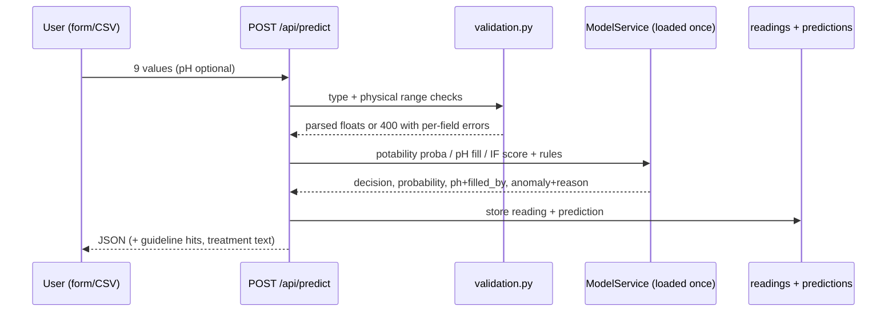

# WATERNET Architecture

```mermaid
flowchart LR
    subgraph Browser
        UI["6 pages (HTML/CSS/JS + Chart.js)<br/>Dashboard - Predict - Bulk - History - Comparison - Explorer"]
    end
    subgraph Flask["Flask app factory (python run.py)"]
        BP["Blueprints<br/>predict - readings - stats - models - dataset - pages"]
        SVC["Service layer<br/>prediction - readings/stats - model_service - plots - dataset"]
        MS["ModelService<br/>models loaded ONCE at startup"]
        VAL["validation.py<br/>ranges + required fields"]
    end
    subgraph DB[("SQLite (default) / MySQL via DATABASE_URL")]
        T1[("water_quality_dataset")]
        T2[("readings")]
        T3[("predictions")]
        T4[("model_runs")]
    end
    subgraph ML["ML pipeline (python -m backend.ml.train_all)"]
        IMP["load_dataset.py<br/>CSV inspect + import"]
        TRN["train_classifier / train_ph_regressor / train_isolation_forest"]
        ART["saved_models/*.joblib<br/>outputs/**/*.json + PNG"]
    end
    CSV["data/real/water_potability.csv<br/>(Kaggle, 3276 rows)"] --> IMP --> T1 --> TRN --> ART
    ART --> MS
    UI -->|fetch JSON| BP --> SVC --> VAL
    SVC --> T2 & T3
    SVC --> MS
    SVC --> ART
```

## Data flow (prediction)



## Data flow (training)

1. `load_dataset.py` inspects the real CSV columns, maps case-insensitively,
   generates `sample_id` 1..N, writes `water_quality_dataset` (idempotent replace)
   and a data-quality report JSON.
2. `train_classifier.py` splits FIRST (20% stratified, `random_state=42`), then
   GridSearchCV with inner 5-fold stratified CV on the training split only;
   SMOTE lives inside the imblearn pipeline (fitted per fold); final one-shot
   evaluation on the untouched test set.
3. `train_ph_regressor.py` trains on rows with 0 < pH < 14 only, and stores the
   app decision (model vs median) in `ph_regressor.json`.
4. `train_isolation_forest.py` fits on training features only (contamination="auto",
   justified in code and docs).
5. `make_plots.py` / trainer scripts save every graph as JSON (+PNG where Chart.js
   cannot draw it). The API serves both; no chart numbers are hard-coded.

See `model_details.md` for the protocol details and `limitations.md` for the honest caveats.
